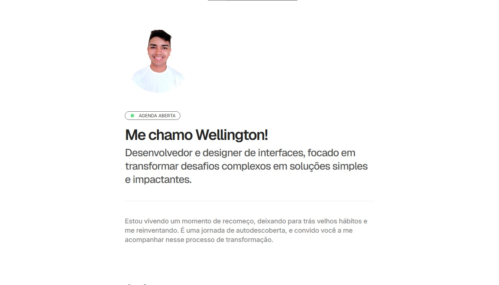

# Blog Pessoal
[](https://welldssvieira.me)



> [!NOTE]
> Este projeto está em evolução contínua. O foco é aprendizado prático, clareza visual e organização pessoal enquanto desenvolvo minhas habilidades em tecnologia, design e escrita.

---

## Sobre

Este é o **blog pessoal de Wellington Vieira**, desenvolvido do zero com HTML, CSS e JavaScript puro.

O projeto funciona como:
- Espaço de escrita e reflexão pessoal  
- Registro público de aprendizado em tecnologia  
- Laboratório prático de desenvolvimento front-end  
- Exercício de design minimalista e organização de conteúdo  

Os artigos abordam principalmente:
- Programação e desenvolvimento web  
- Design de interfaces (UI/UX)  
- Produtividade, organização e minimalismo  
- Processo de recomeço, aprendizado contínuo e construção de projetos  

O blog é **estático**, leve, sem frameworks, e prioriza **clareza, performance e controle total do código**.

---

## Estrutura do Projeto

- HTML semântico  
- CSS customizado
- JavaScript para interações simples  
- SEO manual via meta tags  
- Open Graph e Twitter Cards configurados  
- Animações leves com AOS (Animate On Scroll)  

Não há backend, banco de dados ou build step neste momento.

---

## Funcionalidades

- 📄 Página inicial com apresentação pessoal  
- 📰 Listagem de artigos recentes  
- 🧠 Conteúdo focado em aprendizado e reflexão  
- 🎨 Design minimalista e limpo  
- 📱 Layout responsivo  
- 🔍 SEO básico configurado manualmente  
- 🌐 Open Graph e Twitter Cards  
- ⚡ Site leve e rápido (HTML + CSS + JS)  

Funcionalidades em estudo / futuras:
- Contador de visualizações por artigo  
- Cálculo automático de tempo de leitura  
- Página com listagem completa de artigos  
- Melhorias de tipografia e espaçamentos  
- Organização de conteúdo por tags  

---

## Pré-requisitos

Para rodar o projeto localmente, você precisa apenas de:

- Um navegador moderno (Chrome, Edge, Firefox, Safari)
- Opcional: um editor de código (VS Code recomendado)

Compatível com:
- Windows  
- Linux  
- macOS  

Nenhuma dependência externa obrigatória.

---

## Instalando o projeto

Clone o repositório:

```bash
git clone https://github.com/welldssvieira/welldssvieira.me.git
````

Acesse a pasta do projeto:

```bash
cd welldssvieira.me
```

Abra o arquivo `index.html` diretamente no navegador
ou utilize um servidor local simples, como:

```bash
# Exemplo com Live Server (VS Code)
```

---

## 📫 Contribuindo

Este é um projeto pessoal, mas sugestões são bem-vindas.

Para contribuir:

1. Faça um fork do repositório
2. Crie um branch

   ```bash
   git checkout -b minha-sugestao
   ```
3. Faça suas alterações e commit

   ```bash
   git commit -m "Descrição clara da mudança"
   ```
4. Envie para o repositório remoto

   ```bash
   git push origin minha-sugestao
   ```
5. Abra um Pull Request

Sugestões, melhorias de código, organização ou feedback de UX são sempre bem-vindos.

---

## 📝 Licença

Este projeto está sob licença **MIT** (ou a licença que você decidir).

Veja o arquivo [LICENSE](LICENSE.md) para mais detalhes.

```
```
